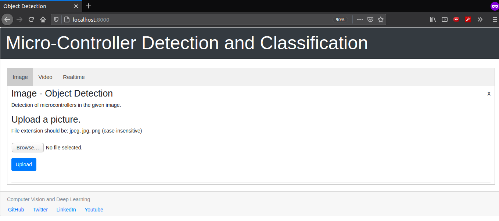
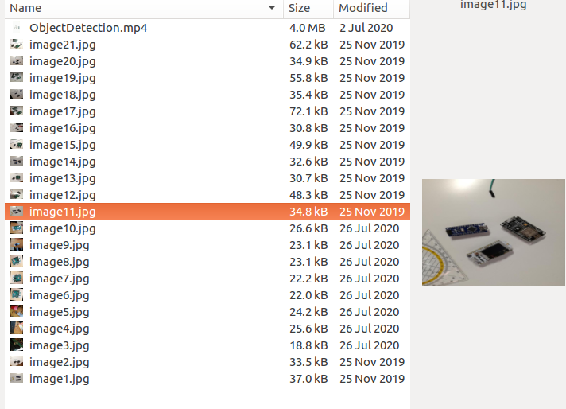

# Flask app for microcontroller component detection

* Replace Filepaths everywhere starting with /home/haresrv/.... with your local paths
* Make sure to clone https://github.com/haresrv/ZigZag/ if you didn't already. 
* Install necessary packages imported in detector_app.py. You are good to go

## Screenshots --> 

  

  

  

